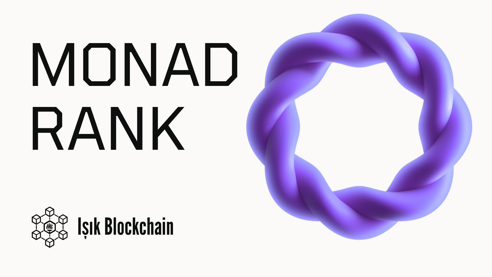
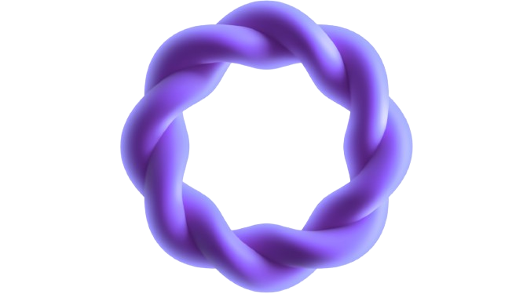

<p align="center">
  
</p>

<h1 align="center">Monad Rank 🪩</h1>
  <b>On-chain SocialFi Analytics for Monad Community</b><br/>
  Monad topluluğundaki katkıyı ölçen, sıralayan ve on-chain olarak ödüllendiren Farcaster mini-app.
</p>

---

## 🎯 Amacımız

<p align="center">
  
</p>

**Hangi Problemi Çözüyoruz:**

Bugün yüzlerce kişi **Monad** hakkında içerik üretiyor, Farcaster’da konuşuyor, etkileşim veriyor.  
Ama bu içeriklerin hangisi gerçekten etki yaratıyor, kimler toplulukta **en aktif**, kimler Monad’ın büyümesine katkı veriyor — bunu ölçmenin bir yolu yok.  

Dahası, bu kişiler bunu yaparken **bir gelir elde edemiyor**.  
Monad topluluğu büyüyor ama **katkı ölçümü** yok.  
Influencer’lar, geliştiriciler ve Monad ekibi **görünür etkiyi izleyemiyor.**

---

## 💡 Çözüm — Monad Rank


**Monad Rank**; Farcaster’daki Monad içeriklerini analiz eden ve katkıya göre sıralayan on-chain bir mini-app’tir.

- Farcaster’da bulunan Monad ile ilgili tüm içeriklerin etkileşim (like, recast, reply) verilerini toplar.  
- Bu verileri analiz eder, ağırlık puanı verir ve skorlandırır.  
- Sonuçta **gerçek zamanlı bir Liderlik Tablosu (Leaderboard)** ortaya çıkar.  
- Yani, Monad topluluğunun **sosyal nabzını tutan** bir on-chain sıralama sistemi oluşturur.

---

## 🏆 Ödül & Ekonomi


**Monad Rank** sadece veri göstermez — aynı zamanda **katkıyı ödüllendirir.**

### 🎁 Ödüller:
- Kullanıcılar içerik üreticilerine **bağış (donation)** yapabilir.  
- Her bağıştan **%1 komisyon** platforma gelir olur.  
- Uzun süre top sıralarda kalanlar **Creator NFT** kazanır (on-chain reputasyon).  
- Monad Foundation, içerik üreticilerine aylık belirli bir **ödül havuzu** bağlayabilir.

---

## ⚖️ Rakip / Sektör Analizi


| Özellik | **Monad Rank** | **Kaito** |
|----------|----------------|------------|
| **Amaç** | Monad topluluğundaki katkıyı ölçmek, sıralamak ve on-chain ödüllendirmek | Web3 genelinde sosyal veriyi analiz etmek, AI destekli içgörü üretmek |
| **Hedef Kitle** | Monad topluluğu, içerik üreticileri, geliştiriciler, markalar | Analistler, yatırımcılar, fon yöneticileri |
| **Etkileşim Ölçümü** | Tüm etkileşimler dinamik puan sistemine dahil | Yok |
| **On-chain Entegrasyon** | Monad testnet üzerinde bağış + NFT + reputasyon | Yok |
| **Ödül Sistemi** | Bağış + NFT ödülleri + on-chain reputasyon | Yok |
| **Topluluk Katılımı** | Aktif (bağış, yarışma, katkı puanı) | Pasif |
| **Farcaster Entegrasyonu** | Tam — Neynar API + Farcaster Frames | Sınırlı |

---

## ⚙️ Tech Stack


**Frontend:**  
Vite + React + Tailwind CSS + MiniApp SDK  

**API & Veri:**  
Neynar API + Farcaster API  

**Smart Contracts:**  
Solidity + Hardhat (Monad Testnet)  

**Güncelleme Mantığı:**  
Incremental Fetching + React Hooks  

---

## 🧩 Mimarî Akış

1. Farcaster → **Neynar API** ile “monad” içeren gönderiler çekilir.  
2. **React + Tailwind** ile dinamik leaderboard oluşturulur.  
3. **Solidity + Hardhat** ile bağış ve NFT işlemleri Monad testnet’te çalışır.  
4. (Opsiyonel) **AI katmanı**, gönderilerdeki karmaşık kodları düzenler.  
5. Tüm etkileşimler **gerçek zamanlı olarak güncellenir**.

---

## 💻 Kurulum (Local Setup)

```bash
# 1️⃣ Repo klonla
git clone https://github.com/username/monad-rank.git
cd monad-rank

# 2️⃣ Bağımlılıkları yükle
npm install

# 3️⃣ Ortam değişkenlerini ayarla (.env)
NEYNAR_API_KEY=xxxxx
OPENAI_API_KEY=xxxxx

# 4️⃣ Geliştirme sunucusunu başlat
npm run dev

# 5️⃣ Hardhat ile test / deploy
npx hardhat test
npx hardhat run scripts/deploy.js --network monad-testnet

---
```
## 👥 Ekibimiz

| Üye | Rol |
|------|-----|
| **Berk Deniz Çakır** |
| **Fatih Altınışık** |
| **Mert Ali Dalkır** |

---
##🧡 Teşekkür Ederiz!
<p align="center">
  
  <br/><br/>
  <b>Monad Rank x Işık Blockchain</b><br/>
  <i>“Katkıyı on-chain hale getiriyoruz.”</i>
</p>
```

